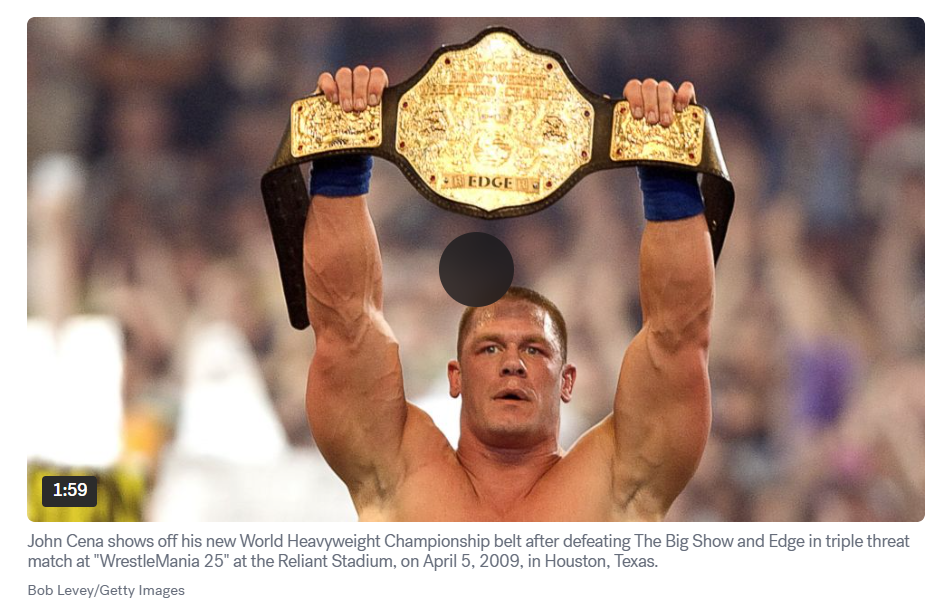

# johncena

#
### [𝕏 BTC Address](https://xbtc.netlify.app/)
### bc1qnuf55nfepvp0v3g9e7dwv3g3jpw9vc04pg9883
#
#
 Other BTC Address:TBA  // 
 ETH Address: TBA

Here’s an ancient geometric breakdown of [John Cena](https://cafecito.app/gatox), interpreted as an analysis using geometric concepts akin to how ancient thinkers like the Greeks studied shapes, proportions, and harmony in the world and human form. Since John Cena is a modern figure—a wrestler, actor, and cultural icon—I’ll apply these timeless principles to his physique, wrestling style, and career in a creative and meaningful way.

---

### **1. Physique and Proportions**
John Cena’s muscular build can be broken down into geometric shapes that symbolize strength and stability, reflecting ideals from ancient geometry:
- **Torso**: Imagine his chest and midsection as a **rectangular prism** or **cube**. In ancient Greek thought, the cube represented solidity and earth—fitting for Cena’s powerful, grounded presence.
- **Arms and Legs**: These resemble **cylinders**, suggesting both strength and flexibility. Cylinders evoke the columns of ancient temples, blending utility and form.
- **Head**: A **sphere**, a shape the ancients associated with perfection and balance, mirroring Cena’s disciplined physique.

The Greeks, through figures like Polykleitos and his statue *Doryphoros*, emphasized the human body’s proportions, often aligning them with the **golden ratio** (approximately 1.618). This ratio was believed to create harmony and beauty, seen in sculptures and architecture. While I don’t have Cena’s exact measurements, his bodybuilding background suggests his proportions—say, the ratio of his height to his torso or arms—might approach such ideals, showcasing the symmetry prized in ancient art.

---

### **2. Wrestling Movements and Geometry**
Cena’s in-ring performance relies on spatial awareness and motion, which we can analyze geometrically:
- **Attitude Adjustment**: His signature move involves lifting an opponent onto his shoulders (a **vertical translation**) and slamming them down along an **arc-like trajectory**. This mirrors ancient studies of curves and conic sections, requiring precise angles and momentum.
- **Five Knuckle Shuffle**: Before delivering this move, Cena waves his hand in front of his face, tracing a **plane** or **semicircle** through space. This gesture manipulates visibility and space, akin to geometric transformations.
- **Ring Strategy**: The wrestling ring, a **square**, has inherent geometric properties. Its diagonals intersect at the center—a key strategic point. Cena uses the ring’s corners, sides, and center to position himself, leveraging angles for attacks or defenses like a mathematician plotting on a grid.

These movements echo the ancient focus on geometry as a tool to understand motion and structure, applied here to the dynamic art of wrestling.

---

### **3. Career Trajectory and Impact**
Cena’s career can be visualized through geometric patterns:
- **Rise to Fame**: His journey in WWE resembles an **exponential curve**. Starting modestly, his success surged with championship wins and fame, a steep upward trajectory plotted over time.
- **Cultural Influence**: His reach across wrestling, movies, and philanthropy suggests a **fractal pattern**—a shape that repeats at different scales. His influence branches out, maintaining a consistent impact across diverse fields.

This geometric lens highlights how Cena’s growth follows structured, almost mathematical progression, a nod to ancient thinkers who saw order in natural phenomena.

---

### **4. Symbolic Geometry**
In ancient sacred geometry, shapes carried meaning, and we can assign one to Cena:
- **Cube**: Symbolizing stability and strength, it fits his resilient, dependable persona as a wrestling “face” (hero).
- **Sphere**: Representing unity and completeness, it aligns with his multifaceted career—wrestler, actor, philanthropist.

His iconic “You Can’t See Me” gesture—waving his hand in an **arc** or **semicircle**—evokes continuity and flow, geometric shapes that reflect his enduring presence in entertainment.

---

### **Conclusion**
An ancient geometric breakdown of John Cena reveals how timeless principles underpin his success. His physique mirrors the symmetry and proportion of classical ideals, his wrestling moves harness angles and trajectories, and his career follows structured patterns of growth. Like the ancients who saw geometry in nature and humanity, we see in Cena a blend of balance, transformation, and power—proof that even a modern legend can be understood through the lens of ancient wisdom.
